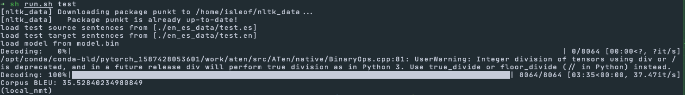

# a4

## 1. Neural machine translation with RNNs

### (g)

It sets the corresponding components of attention scores, $\mathbf{e}_t$ to `-float('inf')`. Then, through softmaxing the components of attention distribution, $\alpha_t$ corresponding to 'pad' tokens are set to zero. Attention output, $\mathbf{a}_t$ also has those components set to zero. The 'pad' tokens do not contain useful information so we do not want the attention mechanism to pay attention to them.

### (i)

Corpus BLEU: **35.53**

### (j)

-  Dot product attention compared to multiplicative attention
  - Advantange: Simplicity. Does not require learned parameters.
  - Disadvantage: Encoder and Decoder needs to have same dimensions for hidden states; multiplicative attention can learn more complicated attention weighing schemes.

- Additive attention compared to multiplicative attention
  - Advantage: Can learn more complicated interaction between encoder hidden states and decoder state through separately learned parameters $\mathbf{W}_1$ and $\mathbf{W}_2$.
  - Disadvantage: Applying $\tanh$ to vectors is less efficient to compute than matrix multiplications.

As a matter of fact, additive attention seem to perform better than multiplicative attention:

> While the two are similar in theoretical complexity, dot-product attention is much faster and more space-efficient in practice, since it can be implemented using highly optimized matrix multiplication code.
>
>  While for small values of $d_k$ the two mechanisms perform similarly, additive attention outperforms dot product attention without scaling for larger values of $d_k$. We suspect that for large values of $d_k$, the dot products grow large in magnitude, pushing the softmax function into regions where it has extremely small gradients
>
> <cite>(Vaswani et al. 2017)</cite>

## 2. Analyzing NMT systems

### (a)

#### i.

1. "otro de mis favoritos" is mis-translated as "another favorite of my favorites".
2. Idiomatic phrase where a word in the correct translation is implied in the source.
3. Add more data that contain phrases that have one-to-many relations between the source words and target words.

#### ii.

1. The phrase "el autor para ni˜nos, ms ledo" is translated as "author for children, more reading."
2. The model does not recognize Spanish word ordering that is the opposite of that in English.
3. To recognize inverted word ordering, encode the source using bidirectional RNNs.

#### iii.

1. "Bolingbroke" is translated to "<unk>".
2. By default, out-of-vocabulary word is translated to "<unk>" token.
3. Try a hybrid system that switches to character-based NMT for "<unk>" token.

#### iv.

1. "manzana" is translated as "apple."
2. "manzana" in Spanish spoken in Spain is a homynym that can mean both "apple" and "city block."
3. Add examples where "manzana" is used to mean a "city block."

#### v.

1. "Sala de profesores" is mis-translated into "teachers' lounge."
2. Attention mechanism may erroneously be paying attention to "Ella" at the beginning of the sentence.
3. Try different attention schemes such as additive or normalized dot product.

#### vi.

1. Mis-translation of "100,000 hectáreas."
2. Conversion of SI units into Imperial/US units.
3. Augment the NMT system with handcrafted conversion rules for numerics with units.

### (b)

#### i.

1. En esta vasta sinfona inconclusa del Universo, la vida en la Tierra es como un breve comps; el reino animal, como un solo y nico compas; y la vida humana, una pequea nota de gracia.
2. In this vast unfinished symphony of the universe,  life on Earth is like a brief measure;  the animal kingdom,  like a single measure;  and human life,  a small grace note.
3. In this vast symphony of the universe , life on Earth is like a brief compass -- the animal kingdom , as one single and only <unk> , and human life , a little bit of grace .
4. The phrase "nota de gracia" is translated a "little bit of grace" ignoring the context of a muscial metaphor.
5. The model failed to recognize the musical metaphor at play.
6. Larger hidden state, attention mechanism

#### ii.

1. Stuxnet se comportaba como una rata de laboratorio a la que no le gustaba nuestro queso: lo ola, pero no quera comer.
2. Stuxnet behaved like a lab rat  that didn't like our cheese --  sniffed, but didn't want to eat.
3. Stuxnet behaves like a laboratory rat where I did n't like our cheese : it would wave it , but I did n't want to eat .
4. The model translated as "I didn't like our cheese" rather than "a lab rat that didn't like our cheese."
5. The model failed to recognize that "que" refers back to "una rata."
6. Since this is a common sentence structure, we can try training our model for further epochs to see more of such sentence structures.

### (c)

#### i.

$\textrm{len}(\textbf{c}_1) = \textrm{len}(\textbf{c}_2) = 5, \quad \textrm{len}(\textbf{r}_1) = 6, \quad \textrm{len}(\textbf{r}_2) = 4$ so $\textrm{len}(\textbf{r}) = 5$ for the purpose of computing $\textrm{BP}$ for $\textbf{c}_1$ and $\textbf{c}_2$.

For $\textbf{c}_1$, $p_1 = 3/5$ and $p_2 = 1/2$ so $\textrm{BLEU}(\textbf{c}_1; \textbf{r}_1, \textbf{r}_2) \cong 0.548$.

For $\textbf{c}_2$,  $p_1 = $ and $p_2 = $ so $\textrm{BLEU}(\textbf{c}_2; \textbf{r}_1, \textbf{r}_2) \cong 0.632$.

According to BLEU scores, $\textbf{c}_2$: "love can make anything possible" is the better translation. We agree.

#### ii.

$5 = \textrm{len}(\mathbf{c}_i) \geq \textrm{len}(\mathbf{r}_1) = 6$ so $\textrm{BP} = \exp(-0.2) \cong 0.819$.

For $\textbf{c}_1$, $p_1 = 3/5$ and $p_2 = 1/2$ so $\textrm{BLEU}(\textbf{c}_1; \textbf{r}_1) \cong 0.448$.

For $\textbf{c}_2$,  $p_1 = 2/5$ and $p_2 = 1/4$ so $\textrm{BLEU}(\textbf{c}_2; \textbf{r}_1) \cong 0.259$.

According to BLEU scores now, $\textbf{c}_1$: "the love can always do" is the better translation. We disagree that it is a better translation.

#### iii.

With only a single reference BLEU scores do not take into account multiple valid ways to translate the source so may   have inferior translations score higher.

#### iv.

- Advantages:
  1. Reported to correlate well with human evaluation.
  2. Can be computed automatically.
- Disadvantages:
  1. Only works well on the corpus level since any zeros in precision scores will zero the entire BLEU score.
  2. Many researchers have optimized BLEU scores until they have begun to approach the same BLEU scores between reference translations, but the true quality remains far below human translations.

## References

Vaswani, Ashish, Noam Shazeer, Niki Parmar, Jakob Uszkoreit, Llion Jones, Aidan N. Gomez, Lukasz Kaiser, and Illia Polosukhin. 2017. “Attention Is All You Need.” In. https://arxiv.org/pdf/1706.03762.pdf.

