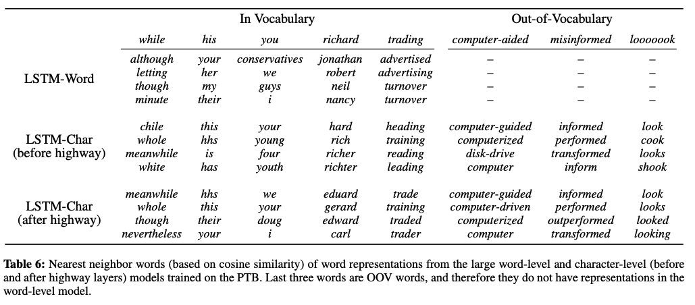
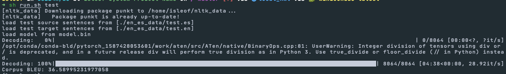

# a5

## 1. Character-based convolutional encoder for NMT

### (a)

The shape of CNN parameters is independent of the length of the input sentence. The shape is given by (word embedding size, character embedding size, kernel size). The shape of the its output depends on the lengths of the input sequences, but that dimension is collapsed the max-pool layer.

### (b)

For kernel size $5$, padding should be at least 2 to fit one full window.

### (c)

According to Kim et al.[^1] Highway layer, this allows word embedding to better learn semantic and structural information.

[^1]: Character-Aware Neural Language Models, Kim et al., 2016. https://arxiv.org/abs/1508.06615

I would initialize $\mathbf{b}_{\textrm{gate}}$ to be negative so as to initialize the layer to simply passing its inputs through.

### (d)

1. Self-attention mechanism of the Transformer is better able to learn long term relations. No locality bias.
2. Single multiplication per layer so able to parallelize better than the inherently sequential RNNs.

### (f) Write a short description of the tests you carried out, and why you believe they are sufficient.

We test for correctness of shapes of the output and intermediate values such as the projection and gate.

### (g)

We test for correctness of the shape of the output.

## 2. Character-based LSTM decoder for NMT

BLEU Score: **36.59**

## 3. Analyzing NMT Systems

### (a)

| word      | id    |
| --------- | ----- |
| traducir  | 4608  |
| traduzco  | 46416 |
| traduces  |       |
| traduce   | 7830  |
| traduzca  | 42522 |
| traduzcas |       |

This illustrates a potential problem with a word-based NMT system not being able to translate closely related forms of otherwise frequently encountered words. Character-aware NMT may overcome this problem by learning how to conjugate verbs. For instance, it could associate the stems "traduc-" and "traduz-" with the meaning "to translate" while extracting information on how to conjugate from the endings "-ir", "-co", "-es", "-e", "-a", "-as".

### (b)

#### i.

- **financial**: economic (0.337)
- **neuron**: neurons (0.439)
- **Francisco**: san (0.171)
- **naturally**: occuring (0.447)
- **expectation**: operator (0.552)

#### ii.

- **financial**: vertical (0.301)
- **neuron**: Newton (0.354)
- **Francisco**: France (0.420)
- **naturally**: practically (0.302)
- **expectation**: exception (0.389)

#### iii.

Word2Vec models semantic similarity; CharCNN models similarlity of spelling and forms. Similar words in Word2Vec are words that are used in similar context so are similar in meaning. Similarity in CharCNN tend to be in terms of more local features such as spelling and morphology. This is in accordance with the fact that character-level approach extracts the embedding vectors from the characters of the word rather than all the words in a context  window.

### (c)

Acceptable:

1. En uno de mis roles, trabajo con la historia de la anatoma.
2. As the one hat,  I do history of anatomy.
3. In one of my __<unk>__ I work with the history of anatomy.
4. In one of my __roles__, I work with the history of anatomy.
5. This is an acceptable translation and surprisingly better than the reference translation. In the test set, the reference translation translates "roles" metaphorically as "hats" and that could be tripping up the word-based model. Character-based model correctly translates to the word as is.

Incorrect:

1. Hoy estoy aqu para hablarles sobre crculos y epifanas.
2. I'm here today to talk to you  about circles and epiphanies.
3. I'm here to talk to you about circles and __<unk>__
4. I'm here today to talk about circles and __epidemics__.
5. This is an unacceptable translation. It translated "epifanas" to an English word that also begins with the Greek prefix "epi" though the meaning of the words are different.

